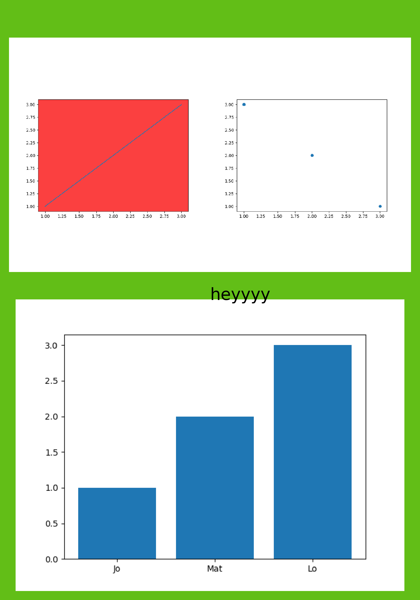

# Plotch: patchwork for matplotlib

This project is a work in progress.

<br>

```python
import matplotlib.pyplot as plt
import plotch

_, ax1 = plt.subplots()
ax1.set_facecolor("#fb4040")
ax1.plot([1, 2, 3], [1, 2, 3])

_, ax2 = plt.subplots()
ax2.scatter([1, 2, 3], [3, 2, 1])

_, ax3 = plt.subplots()
ax3.bar(["Jo", "Mat", "Lo"], [1, 2, 3])


(ax1 + ax2) / ax3

fig = plt.gcf()

fig.text(0.5, 0.5, "heyyyy", size=20)
fig.set_facecolor("#62be17")

plt.show()
```


