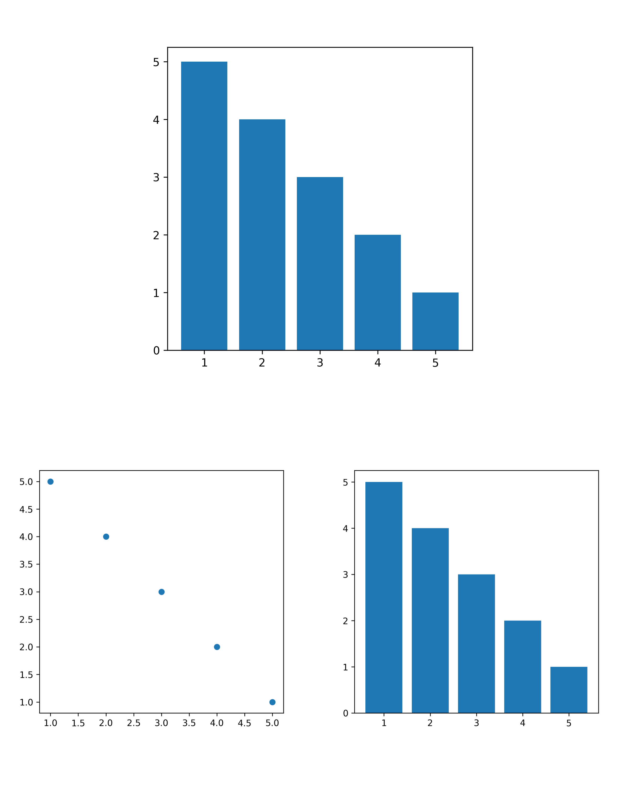

# Plotch: gluing plots in matplotlib

This project is still under development, but if you have any ideas, advice or would like to contribute, please don't hesitate to contact me!

<br>

```python
import matplotlib.pyplot as plt
import pandas as pd
import plotch

df = pd.DataFrame({
   "x": [1, 2, 3, 4, 5],
   "y": [5, 4, 3, 2, 1],
})

_, ax1 = plt.subplots(figsize=(5, 5))
ax1.scatter(df["x"], df["y"])

_, ax2 = plt.subplots(figsize=(5, 5))
ax2.bar(df["y"], df["x"])
```

And then we glue Axes together:

```python
ax1 + ax2
```


```python
ax1 / ax2
```


```python
(ax1 + ax2) / ax2
```


```python
ax2 / (ax1 + ax2)
```



<br/><br/><br/>

## Current progress

### Capabilities

- The `+` and `/` operators are "easy" to make usable
- Charts looks okay with 2 or 3 Axes

### Limitations

- Scales very badly with 3 or more Axes
- Having to call `plt.subplots()` many times is not the best
- When initial figures are not squared, looks weird
