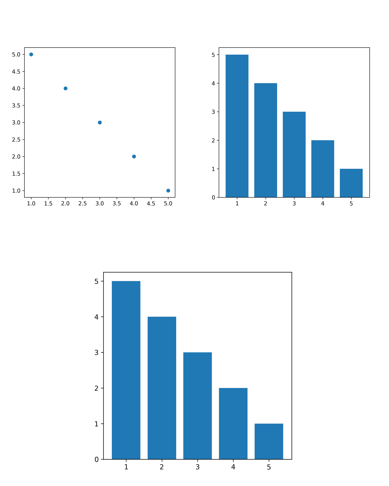

# Plotch: patchwork for matplotlib

This project is a work in progress.

<br>

```python
import matplotlib.pyplot as plt
import numpy as np
import pandas as pd
import plotch

df = pd.DataFrame({
   "x": [10, 34, 71, 42, 82],
   "y": [1, 2, 3, 4, 5],
   "labels": ["A", "B", "C", "D", "E"],
})

_, ax1 = plt.subplots(figsize=(5, 5))
ax1.scatter(df["x"], df["y"])

_, ax2 = plt.subplots(figsize=(5, 5))
ax2.bar(df["y"], df["x"])
```

And then we glue Axes together:

```python
ax1 / ax2
```


```python
ax1 + ax2
```


```python
(ax1 + ax2) / ax2
```


